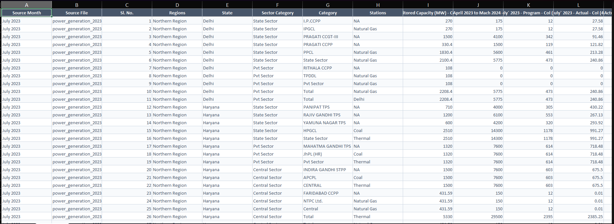
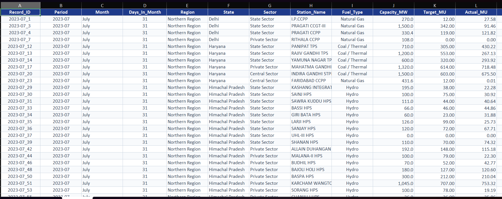
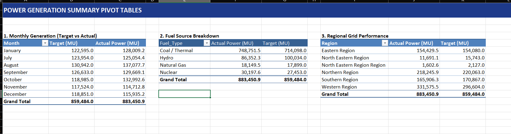
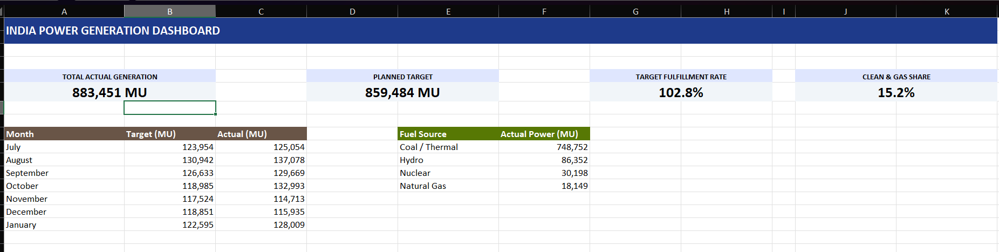
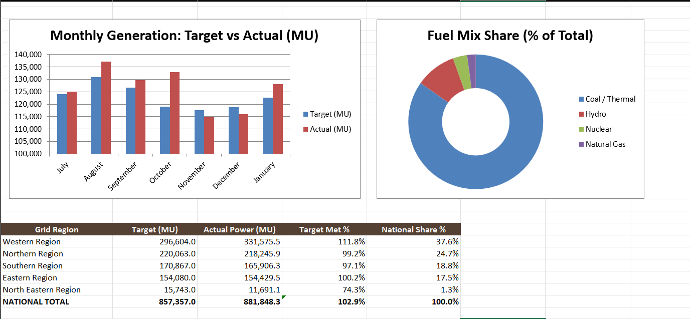

# India Power Generation Analysis (2023–2024)

An Excel data analysis project exploring electricity generation trends, fuel sources, and regional grid performance across India.

---

## Project Overview

In this project, I analyzed 7 months of official power generation data (July 2023 to January 2024) from the Central Electricity Authority (CEA), Ministry of Power.

The dataset covers 542 power stations across 37 Indian States and Union Territories with a total capacity of 305,429 MW. I cleaned the raw monthly data in Excel, calculated key grid metrics, created Pivot Tables, and built an interactive Executive Dashboard.

---

## Workbook Structure

The workbook (`India_Power_Generation_Analytics_2023_2024.xlsx`) has 4 clean sheets:

1. **Raw Data**: All 7 monthly CSV files combined into one table (7,193 rows).
2. **Clean Data**: Cleaned power plant records (3,640 rows) with calculated metric columns.
3. **Pivot Analysis**: Native Excel Pivot Tables summarizing power by Month, Fuel Type, and Region.
4. **Dashboard**: High-level visual dashboard with 4 KPI cards, column and donut charts, and a regional summary table.

---

## How I Analyzed the Data in Excel

### Step 1: Combining the Monthly CSVs
I used Excel's Power Query (`Data > Get Data > From File > From Folder`) to merge all 7 monthly reports into a single sheet containing 7,193 raw rows.

---

### Step 2: Cleaning the Data & Removing Subtotals
The raw reports contained subtotal rows mixed in with individual power plants. Genuine power plant rows always had `NA` in Column H (`Stations`). 

I applied a filter on Column H and selected only `NA`. This removed all 3,553 summary rows in one click, leaving 3,640 clean plant records.

---

### Step 3: Categorizing Fuel Types
To ensure clean grouping in Pivot Tables, I standardized all power stations into 4 main fuel categories:
* **Coal / Thermal** (Thermal coal and lignite power plants)
* **Hydro** (Hydroelectric dams and stations)
* **Nuclear** (Nuclear power stations)
* **Natural Gas** (Gas-based power plants)

---

### Step 4: Key Formulas Used (in Simple Words)

Rather than hardcoding values, I added 4 calculated metric columns:

* **Target Variance (MU)** = `Actual Generation - Planned Target`
* **Target Met %** = `(Actual Generation / Planned Target) * 100`
* **Year-over-Year Growth %** = `((Current Year Actual - Last Year Actual) / Last Year Actual) * 100`
* **Plant Load Factor (PLF % / Plant Efficiency)** = `(Actual MWh / (Capacity in MW * Days in Month * 24 Hours)) * 100`

---

### Step 5: Pivot Table Analysis
In the `Pivot Analysis` sheet, I created 3 native Excel Pivot Tables to summarize the data:
* **Monthly Generation**: Target vs actual output across all 7 months.
* **Fuel Source Breakdown**: Total electricity produced by Coal, Hydro, Nuclear, and Gas.
* **Regional Grid Performance**: Power generation across Northern, Western, Southern, Eastern, and North Eastern grids.

---

### Step 6: Executive Dashboard
In the `Dashboard` sheet, I created a visual summary for management:
* **4 KPI Scorecards**: Total Generation, Planned Target, Target Met %, and Clean Energy Share.
* **Monthly Clustered Column Chart**: Comparing planned target vs actual electricity generated each month.
* **Fuel Mix Doughnut Chart**: Highlighting the percentage share of each fuel source.
* **Regional Executive Summary Table**: Showing electricity generated and national share by region.

---

## Key Insights from the Data

1. **National Target Was Exceeded (+2.8% Surplus)**: India generated **883,451 MU** of electricity against a planned target of **859,484 MU** (102.8% target achievement). Peak demand was in August and October.
2. **Coal is the Main Baseload Power (84.7%)**: Coal and thermal plants produced **748,752 MU (84.7% of all power)**, exceeding their target by +4.9%.
3. **Hydro Generation Dropped in Winter (9.8%)**: Hydro plants produced **86,352 MU**, but missed targets (86.3% achievement) as dam water levels fell in winter.
4. **Nuclear and Gas Met Targets**: Nuclear produced **30,198 MU (110.0% of target)** and Natural Gas produced **18,149 MU (101.4% of target)**.
5. **Western Grid is the Largest Producer (37.5%)**: The Western Region generated **331,575 MU**, beating its target by +11.8% and supplying power to northern states during peak winter demand.

---

## Project Files

* `India_Power_Generation_Analytics_2023_2024.xlsx`: Master Excel workbook with all 4 sheets.
* `interview_walkthrough_guide.md`: Step-by-step interview explanation guide.
* `data/`: 7 raw CEA monthly power generation CSV files.
